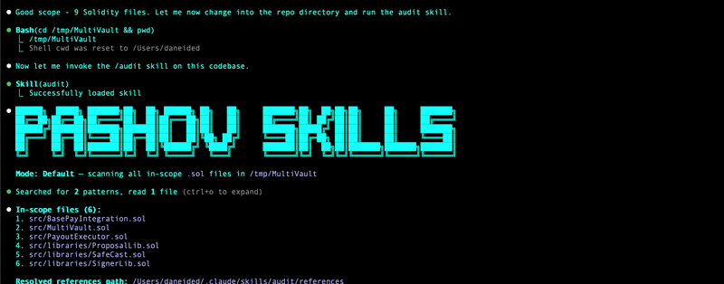

# Solidity Auditor

A security agent with a simple mission — never let "stupid" vulnerabilities make it to your audit report.

## What it does

4 parallel agents scan your contracts against 168 attack vectors — reentrancy, access control, token quirks, flash loans, vaults, integer issues, and more. Each agent triages its vectors, then deep-analyzes only what survives. **Deep mode** adds a fifth agent that reasons adversarially from first principles — no checklist, just "find every way to break this."

Built for **Solidity developers** who want a security check before every commit, **security researchers** looking for fast wins before a manual review, and **anyone building on-chain** who wants an extra pair of eyes. Not a substitute for a formal audit - but the check you should never skip.

## Demo



## Usage

```bash
# Scan the full repo (default)
/solidity-auditor

# Full repo + adversarial reasoning agent (slower, more thorough)
/solidity-auditor deep

# Review specific file(s)
/solidity-auditor src/Vault.sol
/solidity-auditor src/Vault.sol src/Router.sol

# Write report to a markdown file (terminal-only by default)
/solidity-auditor --file-output
```

## Known Limitations

**Codebase size.** Works best up to ~2,500 lines of Solidity. Past ~5,000 lines, triage accuracy and mid-bundle recall drop noticeably. For large codebases, run per module rather than everything at once.

**What AI misses.** AI is strong at pattern matching — missing access controls, unchecked return values, known reentrancy shapes. It struggles with relational reasoning: multi-transaction state setups, specification/invariant bugs, cross-protocol composability, game-theory attacks, and off-chain assumptions. AI catches what humans forget to check. Humans catch what AI cannot reason about. You need both.
